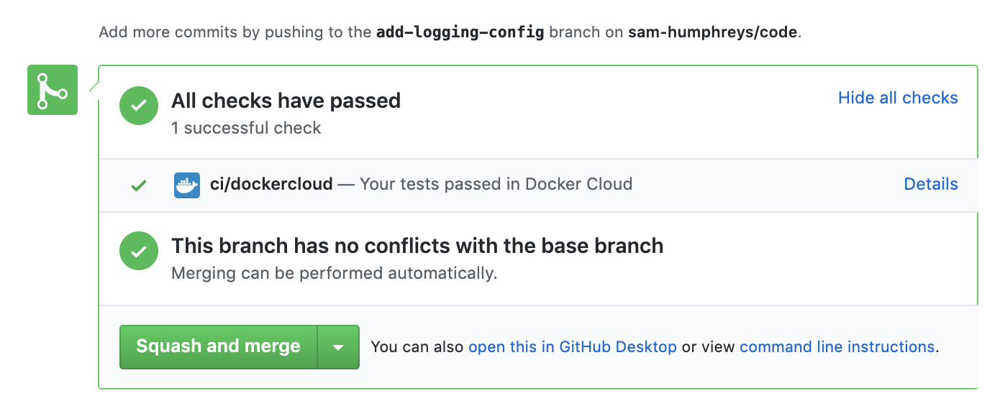

# CODE

## About

This repository serves as an example of my personal coding skills, just for fun. The codebase is written Python (3.7), however also hosts a touch of other technologies such as Docker, Kubernetes and Terraform.

**Feel free to browse and clone this repo or view the simple web application (UI) [here](http://sam-humphreys.co.uk)!**

*Please note that some code may not work due to need for resources other than Python. There are Terraform modules [here](./gitops/gcp/main.tf) for Google Cloud Platform, which could be applied and is what this project utilises.*

## Setup

### Prerequisites
- Clone this repository (HTTPS) - `git clone https://github.com/sam-humphreys/code.git`
- Downloaded and installed Python (3.7 distribution) from [here](https://www.python.org/downloads/)

### Installation
Please ensure you completed all the prerequisites before continuing

1. Navigate to the root directory - `cd ~/code`
2. Make the [shell script](./setup.sh) executable - `chmod u+x setup.sh`
3. Run the shell script - `source setup.sh`

**SUCCESS!**


## Running Commands (CLI)

This project space uses [Click](https://click.palletsprojects.com/en/7.x/) to execute commands.

To run commands simply type `coderun` into the command line, followed by the `coderun [OPTIONS] COMMAND [ARGS]..` syntax. Typing `coderun` by itself will list all the available commands. To run an IPython interactive shell for example, enter - `coderun ipython`. Example usage can be seen in the image below.


To register a new command:
1. Write your functions by either creating a new `@click.group()` or adding to an existing group `@group.command()`
2. Write your new function nested under the group using `@group.command()`
3. If the group is not already listed/registered in the code workspace [main file](./code/main.py):

    a) Import the file you wrote your commands in

    b) Register it using the `main.add_command(code.folder.group)` syntax

## Database

This repository uses Google Cloud PostgreSQL databases. In order to connect locally, the Cloud SQL Proxy is therefore required - read about the proxy [here](https://cloud.google.com/sql/docs/postgres/sql-proxy). For a quick setup you can run the following commands:

1. Download the proxy
```
# MAC
curl -o cloud_sql_proxy https://dl.google.com/cloudsql/cloud_sql_proxy.darwin.amd64

# Linux
wget https://dl.google.com/cloudsql/cloud_sql_proxy.linux.amd64 -O cloud_sql_proxy
```
2. Make the proxy executable
```
# MAC & Linux
chmod +x cloud_sql_proxy
```
3. Connect locally to a DB instance - for example:
```
./cloud_sql_proxy -instances someGCPproject:someGCPregion:someGCPinstance=tcp:9999
```

## Continuous Integration (CI)

This repository uses [Docker Hub](https://hub.docker.com/) to handle CI. This works well due to the low volume of code being pushed and it's also open-source (perfect for this purpose). The main pro of using Docker Hub, is that having configured automated tests, build status' are posted automatically to each open Github pull request upon completion as can be seen in the image below. Docker Hub has also has a Slack integration, so alerts on build/test status' can be tracked easily.



The way Docker Hub is configured, it will:
- Execute an intensive pytest run for each open pull request
- Each time a pull request is merged into master branch:
    - Automatically build the image
    - Due to the [Docker compose test file](./docker-compose.test.yml), it will execute an intensive pytest run at the end of the build
    - Due to the [Docker post push file](./hooks/post_push), create a tag within the Docker Hub repository using the merged Git hash. This enables exact commit referencing, which can be seen in the image in this deployment [here](./gitops/k8s/deployments/watch-pods.yaml).

If the tests fail, the build will too fail, thus enabling smooth CI. This repository uses [Pytest](https://docs.pytest.org/en/latest/) and [Hypothesis](https://hypothesis.readthedocs.io/en/latest/) to run a series of informed and property based tests.

To execute tests from the command line:
- All tests normally: `pytest`
- Change different hypothesis profiles:
    - Fast (less examples, shorter time limits): `pytest --hypothesis-profile=fast`
    - Intensive (more examples, longer time limits): `pytest --hypothesis-profile=intensive`

## Infrastructure as Code (IaC)

This repository utilises [Terraform](https://www.terraform.io) to manage Google Cloud Platform (GCP) resources and act as the primary IaC source. These modules can be found in the Gitops GCP folder [here](./gitops/gcp/main.tf). This repository has been written to work primarily with Kubernetes on GCP, thus there are numerous YAML files acting as a secondary IaC source which can be utilised in addition to the Terraform modules. These YAMLs can be found in the Gitops K8s folder [here](./gitops/k8s/deployments/watch-pods.yaml).

